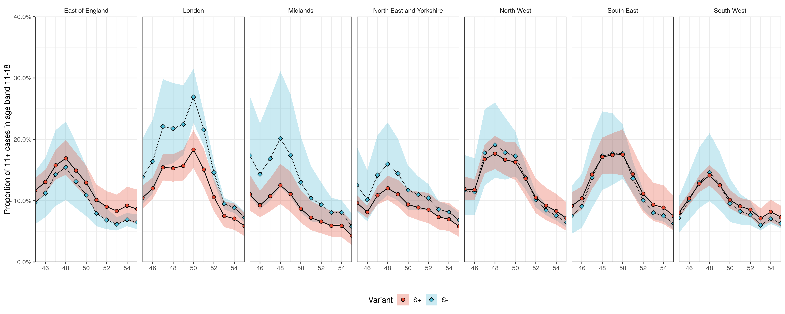
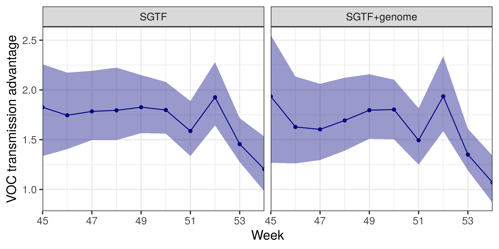

# Transmission advantage of B.1.1.7 in terms of growth factors

This file contains code to estimate the transmission advantage of the variant B.1.1.7 in terms of growth factors, using four models and three dataset combinations. The model is scripted in `growthfactor_model.stan` and is called once each with each dataset--model combination, as below, and in `growthfactor_script.R`. Leave-one-out cross-validation is performed with the `loo` package.

First, load in required libraries:

```r
require(loo)
require(dplyr)
require(rstan)
require(data.table)
```

Then, define variables for use in (a) making file names, (b) calling Stan, and (c) defining the time period.

```r
# file name parts
outdir <- 'figures/'
tbit <- c('','Tminus')
databit <- c('sgss','both','genome')

## for stan 
iters <- 4000
cores <- 2
chains <- 2
thin <- 1

# general purpose
w1 <- 45
w2 <- 55
wks <- w1:w2
```

## SGTF data

Read in the processed dataset: a cross tab data.frame with variables `nhser_name`, `stp_name`, `epiweek` and `ageband`, with counts for each combination of `s_positive_adj1`, `s_negative_adj1`, and `s_na_adj1`. Subset to target weeks.

```r
x16 <- readRDS('../data/stp_age_sgtf.Rds')
x16 <- x16[x16$epiweek>=w1 & x16$epiweek<=w2,]
```
 
Define age groups to use and subset \& aggregate data: 

```r
agebands <- agebands0 <- list(c(11,18),c(19,120))
x16 <- subset(x16,ageband!='0-10')
x16$ageband[x16$ageband!='11-18'] <- '19-120'
x16 <- data.table(x16)[,lapply(.SD, sum, na.rm=TRUE),by=c('nhser_name','stp_name','epiweek','ageband'),
                         .SDcols=c('s_positive_adj1','s_negative_adj1','s_na_adj1')]
```

Extract STP-to-region mapping:

```r
stp2reg <- x16[,lapply(.SD, sum, na.rm=TRUE),by=c('nhser_name','stp_name'),.SDcols=c('s_positive_adj1')]
regions <- stp2reg$nhser_name
```

## Genome data

Extract and process genome data similarly. It is already at the level of NHS region and counts all age groups together.

```r
genomes <- read.csv("../data/B.1.1.7-weightedcounts_nhsregion_date-2021-02-02.csv",stringsAsFactors=F)
genomes$epiweek <- epiweek(genomes$date)
genomes$epiweek[genomes$epiweek<30] <- 53 + genomes$epiweek[genomes$epiweek<30]
genomes$nhser_name=as.factor(genomes$region)
genomes <- genomes[genomes$epiweek>=w1 & genomes$epiweek<=w2,]
```

## Process data for Stan input

Reshape data and summarise its dimensions for input into Stan.

```r
stan_data <- list()
## spatial dimensions and indices
N_reg <- length(unique(regions))
# region parameter
stan_data$N_reg <- N_reg
# genome data
stan_data$N_reg_g <- N_reg
# STPs
N_i <- length(regions)
stan_data$N_i <- N_i
# STP map to region - model
stan_data$reg_ind <- as.integer(regions)
# STP map to region - genome
stan_data$reg_ind_g <- as.integer(regions)
## overwrite for data d=3
stan_data$reg_ind_g_d3 <- 1:length(unique(regions))
stan_data$reg_ind_d3 <- 1:length(unique(regions))
stan_data$N_i_d3 <- length(unique(regions))
## time dimensions and indices
N_t <- length(wks)
stan_data$N_t <- N_t
# time parameters
N_t_par <- N_t-1
stan_data$N_t_par <- N_t-1
stan_data$t_ind <- 1:N_t
## age dimensions and indices
N_age_par <- N_age <- length(agebands0)
stan_data$N_age <- stan_data$N_age_par <- N_age
stan_data$a_ind <- 1:(N_age+1)
## overwrite for data d=3
stan_data$N_age_d3 <- stan_data$N_age_par_d3 <- 1
stan_data$a_ind_d3 <- rep(1,1+1)

## aggregate SGTF data
stan_data$Y_Snegative <- round(xtabs(s_negative_adj1 ~ epiweek + stp_name + ageband, x16))
stan_data$Y_Spositive <- round(xtabs(s_positive_adj1 ~ epiweek + stp_name + ageband, x16))
stan_data$Y_Sna <- xtabs(s_na_adj1 ~ epiweek + stp_name + ageband, x16)

## overwrite for data d=3
stan_data$Y_Snegative_d3 <- array(round(xtabs(s_negative_adj1 ~ epiweek + nhser_name, x16)),dim=c(N_t,N_reg,1),dimnames=list(wks,levels(regions),list('all')))
stan_data$Y_Spositive_d3 <- array(round(xtabs(s_positive_adj1 ~ epiweek + nhser_name, x16)),dim=c(N_t,N_reg,1),dimnames=list(wks,levels(regions),list('all')))
stan_data$Y_Sna_d3 <- array(xtabs(s_na_adj1 ~ epiweek + nhser_name, x16),dim=c(N_t,N_reg,1),dimnames=list(wks,levels(regions),list('all')))

## aggregate genome data
stan_data$genomes_voc <- round(xtabs(B.1.1.7 ~ epiweek + nhser_name , genomes))
stan_data$genomes_nonvoc <- round(xtabs(Other ~ epiweek + nhser_name , genomes))
```

Initialise some flags for use in the model, which can be changed to modify some parts of the model:
```r
## stan code flags
stan_data$prior_only <- F
stan_data$Tonly <- 0
stan_data$infTs <- 1 # infer generation time Tg and CV s
stan_data$Tminus <- 0 # set Tg for S- equal to that for S+?
stan_data$NB <- 1 # fix NB var ~ mean?
stan_data$Gonly <- 1 # use only genome data?
```

Supply hyperparameters for the distribution over the generation time:
```r
stan_data$mean_generation_time_T <- 6.4
stan_data$log_Tg_sd <- 0.5 # gives SD in Tg of 1
stan_data$sq_CV_generation_time_s <- 0.4
stan_data$log_s_sd <- 0.04  # gives SD in CV of Tg of 0.04
```

Finally, initialise values:
```r
init_fun <- function(...) list(b_t=array(-0.0,dim=c(N_t_par,N_reg,N_age_par)),
                               b_std=0.01,b_t_std=0.01, 
                               s_var=0.0,Tg_var=0.0,log_T_ratio=0.0,
                               gamma=0.01, reciprocal_phi=100,
                               firstobspos=array(-0.0,dim=c(N_i,N_age)),
                               firstobsneg=array(-0.0,dim=c(N_i,N_age)),
                               rti=array(-0.0,dim=c(N_t-1,N_i,N_age)))
                               
```

## Create models

The four models are constructed by defining a transmission advantage that has 0, 1, 2 or 3 dimensions. With 0 dimensions, all ages, areas, and weeks have the same transmission advantage. With 1 dimension, the advantage differs by age, but all areas and weeks share a single value. With 2 dimensions, the advantage differs by area and week, but all ages share a single value. With 3 dimensions, all age--region--weeks have their own advantage.

First, define names and copy data list:

```r
modnames <- c('noageortimeorreg','notimeorreg','noage','all')

stan_data0 <- stan_data
stan_data_list <- list()
for(md in modnames) stan_data_list[[md]] <- stan_data0
```

Then, adjust model dimensions in `stan_data` reflecting which covariates are omitted:

```r
## no age models
for(md in modnames[c(1,3)]){
  stan_data_list[[md]]$a_ind <- rep(1,N_age+1)
  stan_data_list[[md]]$N_age_par <- 1
}

## no time or reg models
for(md in modnames[c(1,2)]){
  stan_data_list[[md]]$N_reg <- 1
  stan_data_list[[md]]$reg_ind <- rep(1,stan_data0$N_i)
  stan_data_list[[md]]$reg_ind_d3 <- rep(1,stan_data0$N_i_d3)
  stan_data_list$notimeorreg$N_t_par <- 1
  stan_data_list$notimeorreg$t_ind <- rep(1,stan_data0$N_t)
}
```

Summarise all 24 models in one list (three datasets, four advantage dimensions, and two options for the generation time: whether the VOC shares the non-VOC generation time, or can be different):

```r
model_list <- list()
for(md in 1:length(modnames)){
  for(tt in 0:1){ # whether generation time for VOC will be different or not
    index <- (md-1)*2 + tt + 1
    ab <- agebands0
    if(md%in%c(1,3)) ab <- '11-120'
    model_list[[index]] <- list(modname=modnames[md],tt=tt,agebands=ab) 
  }
}
```

## Run models

The models are run with the Stan model defined in `src/growthfactor_model.stan`:

```r
fileName <- 'src/growthfactor_model.stan'
stan_model <- rstan::stan_model(
  file = fileName,
  model_name= 'stan_model'
)
```

Each model instance is called in turn. LOO is calculated and the results are saved.

```r
mod2run=1:8

for(d in 1:3){
  if(d==3) mod2run <- c(1,2,5,6)
  for(mi in mod2run){
    # read in model-specific variables
    for(mm in 1:length(model_list[[mi]])) assign(names(model_list[[mi]])[mm],model_list[[mi]][[mm]])
    # update stan data 
    stan_data <- stan_data_list[[modname]]
    stan_data$Gonly <- d-2
    stan_data$Tminus <- tt
    # replace if genome only - does not use age or STP geography
    if(stan_data$Gonly==1) 
      for(v in c('a_ind','N_age','N_age_par','N_i','reg_ind','reg_ind_g','Y_Spositive','Y_Snegative','Y_Sna')) 
        stan_data[[v]] <- stan_data[[paste0(v,'_d3')]]
    # update dimensions for init
    N_t_par <- stan_data$N_t_par; N_age_par <- stan_data$N_age_par; N_reg <- stan_data$N_reg; N_i <- stan_data$N_i; N_age <- stan_data$N_age
    # create file name from variables
    rname <- paste0(tbit[tt+1],modname,databit[d])
    fn <- paste0(rname,paste(range(wks),collapse=''),'.Rds')
    # run stan, save
    resStan <- sampling(stan_model, data = stan_data,init=init_fun,
                        chains = chains,cores=cores, iter = iters, thin = thin,
                        control = list(adapt_delta = 0.99, max_treedepth = 15),
                        save_warmup = FALSE)
    saveRDS(list(resStan=resStan,stan_data=stan_data),fn)
    # compute LOO-CV, save
    loo_1 <- loo(resStan, cores = 2, moment_match=T)
    saveRDS(loo_1,paste0('loo',fn))
  }
}
```

## Plot results

Extract the model's predicted share of ages over time for all regions.

```r
mod2run=1:8

for(d in 1:2){
  for(mi in mod2run){
    # read in model-specific variables
    for(mm in 1:length(model_list[[mi]])) assign(names(model_list[[mi]])[mm],model_list[[mi]][[mm]])
    # update stan data 
    stan_data <- stan_data_list[[modname]]
    # create file name from variables
    rname <- paste0(tbit[tt+1],modname,databit[d])
    fn <- paste0(rname,paste(range(wks),collapse=''),'.Rds')
    resStan <- readRDS(fn)[[1]]

    ## set up variables to use
    outfile.base <- rname
    ##
    ## build labels
    ##
    lbls <- expand.grid(week=wks,
                        loc=levels(regions),
                        age_band=unlist(sapply(agebands0,paste,collapse='-')),stringsAsFactors=F)#,
    lbls$loc_idx <- match(lbls$loc,unique(lbls$loc))
    lbls$week_idx <- match(lbls$week,unique(lbls$week))
    lbls$age_idx <- match(lbls$age_band,unique(lbls$age_band))

    po <- rstan::extract(resStan)
    
      
    ##
    ## make share of age groups over time
    ##
      
    dsa <- as.data.table(reshape2::melt(po$pi_negative)) # expected_Snegative)) # 
    setnames(dsa, 2:4, c('week_idx','loc_idx','age_idx'))
    dsa[, variable := 'S_negative']
    tmp <- as.data.table(reshape2::melt(po$pi_positive)) # expected_Spositive)) # 
    setnames(tmp, 2:4, c('week_idx','loc_idx','age_idx'))
    tmp[, variable := 'S_positive']
    dsa <- rbind(dsa, tmp)
    dsa <- merge(dsa, lbls, by=c('week_idx','loc_idx','age_idx'))
    
    dsa <- dsa[, list(value=quantile(value, p=c(.5,.025,.975)), stat=c('M','CL','CU')), by=c('week_idx','loc_idx','age_idx','variable')]
    dsa <- dcast.data.table(dsa, week_idx+loc_idx+age_idx+variable~stat, value.var='value')
    
    dsa <- merge(dsa, lbls, by=c('week_idx','loc_idx','age_idx'))
    #dp <- dsa#subset(dsa, loc%in%c('London',"East of England","South East"))
    dp <- subset(dsa,age_band=='11-18')
    p <- ggplot(dp, aes(x=week )) +
      geom_ribbon(data=dp, aes(ymin=CL, ymax=CU, fill=factor(variable, levels=c('S_positive','S_negative'), labels=c('S+','S-')), group=variable), alpha=0.3) +
      geom_line(aes(y=M, linetype=factor(variable, levels=c('S_positive','S_negative'), labels=c('S+','S-')), group=variable), show.legend= FALSE) +
      geom_point(aes(y=M, fill=factor(variable, levels=c('S_positive','S_negative'), labels=c('S+','S-')), pch=factor(variable, levels=c('S_positive','S_negative'), labels=c('S+','S-'))), size=2) +
      ggsci::scale_colour_npg() +
      ggsci::scale_fill_npg() +
      scale_x_continuous(expand=c(0,0),breaks=wks[seq(2,length(wks),by=2)]) +
      scale_y_continuous(labels= scales::percent, expand=c(0,0), lim=c(0,.4), breaks=seq(0,1,.1)) +
      coord_cartesian(ylim=c(0,0.4)) +
      scale_linetype_manual(values=c('S-'='11','S+'='solid')) +
      scale_shape_manual(values=c('S-'=23, 'S+'=21)) +
      theme_bw() +
      labs(x='', y='Proportion of 11+ cases in age band 11-18', colour='Variant', fill='Variant', pch='Variant') +
      facet_grid(~loc) +
      guides(colour=FALSE) +
      theme(text=element_text(family="sans"),
            legend.position='bottom',
            panel.spacing = unit(.5, "lines"),
            strip.background = element_blank()
      )
    ggsave(file=file.path(outdir, paste0(outfile.base,'_shareage_time.png')), p, limitsize = FALSE, w=15, h=6)
    ggsave(file=file.path(outdir, paste0(outfile.base,'_shareage_time.pdf')), p, limitsize = FALSE, w=15, h=6)
  }
}
```  

Plot of age distribution of cases over time with advantage varying across time and region, but not age, and with the generation time the same for the VOC and non-VOC:


Extract the advantage of the VOC over time, aggregate over all regions, and compare the model using SGTF data vs. both datasets:

```r
## plot two advantages ##############################
##
## make transmission advantage over time
##
# select models
rlistsgss <- readRDS('./noagesgss4555.Rds')
rlistboth <- readRDS('./noageboth4555.Rds')
## get first model advantage
resStan <- rlistsgss[[1]]
po <- rstan::extract(resStan)
dsa <- as.data.table(reshape2::melt(po$b_t))
setnames(dsa, 2:4, c('week_idx','loc_idx','age_idx'))
set(dsa, NULL, 'value', dsa[,exp(value)])
dsa <- dsa[, list(value=quantile(value, p=c(.5,.025,.975)), stat=c('M','CL','CU')), by=c('week_idx','age_idx')]
dsa <- dcast.data.table(dsa, week_idx+age_idx~stat, value.var='value')
dsa <- merge(dsa, lbls, by=c('week_idx','age_idx'))
dsa$dataset <- 'SGTF'
## get second model advantage
resStan <- rlistboth[[1]]
po <- rstan::extract(resStan)
dsa2 <- as.data.table(reshape2::melt(po$b_t))
setnames(dsa2, 2:4, c('week_idx','loc_idx','age_idx'))
set(dsa2, NULL, 'value', dsa2[,exp(value)])
dsa2 <- dsa2[, list(value=quantile(value, p=c(.5,.025,.975)), stat=c('M','CL','CU')), by=c('week_idx','age_idx')]
dsa2 <- dcast.data.table(dsa2, week_idx+age_idx~stat, value.var='value')
dsa2 <- merge(dsa2, lbls, by=c('week_idx','age_idx'))
dsa2$dataset <- 'SGTF+genome'
dsa <- rbind(dsa,dsa2)
## plot
p <- ggplot(dsa, aes(x=week)) +
  geom_ribbon(aes(ymin=CL, ymax=CU), fill='navyblue', alpha=.4) +
  geom_line(aes(y=M), colour='navyblue') +
  geom_point(aes(y=M), colour='navyblue') +
  ggsci::scale_colour_npg() +
  ggsci::scale_fill_npg() +
  scale_x_continuous(expand=c(0,0),breaks=wks[seq(1,length(wks),by=2)]) +
  labs(x='Week',y='VOC transmission advantage') +
  theme_bw(base_size = 15) + facet_wrap(~dataset) +
  theme(legend.position = '')
p
ggsave(file=file.path(outdir, paste0('sgssandboth_VOCtrmadvtime_overall.pdf')), p, limitsize = FALSE, w=8, h=4)
ggsave(file=file.path(outdir, paste0('sgssandboth_VOCtrmadvtime_overall.png')), p, limitsize = FALSE, w=8, h=4)
}
```

Plot of overall advantage over time with advantage varying across time and region, but not age, and with the generation time the same for the VOC and non-VOC:



## Evaluate models

We evaluate the models using functions implemented in the package `loo` ([see package details here](http://mc-stan.org/loo/articles/loo2-with-rstan.html)) to compute two metrics: leave-one-out (LOO) cross validation (with Pareto-smoothed importance sampling \& moment matching), and the widely applicable information criterion (WAIC).

```r
resdir <- './'
regex_pars = "b_t|reciprocal_phi|rti|log_growth_Spos_t_sd|b_std|b_t_std|log_T_ratio|s_var|Tg_var"
reslist <- list()
for(d in 1:3){
  mod2run <- 1:8
  if(d==3) mod2run <- c(1,2,5,6)
  tt <- 1 # 0=no T minus, 1=T minus = y T plus
  loos <- loo_list <- waics <- Ts <- bs <- list()
  for(i in 1:length(mod2run)){
    # extract model values
    mi <- mod2run[i]
    for(mm in 1:length(model_list[[mi]])) assign(names(model_list[[mi]])[mm],model_list[[mi]][[mm]])
    # make file name
    rname <- paste0(tbit[tt+1],'infTsBBV',modname,databit[d])
    fn <- paste0(resdir,rname,paste(range(wks),collapse=''),'.Rds')
    # read in
    resStanlist <- readRDS(fn)
    resStan <- resStanlist$resStan
    # print diagnostics
    su <- summary(resStan)$summary
    su <- su[grepl(regex_pars,rownames(su)), ]
    print(c(mi,min(su[,'n_eff']),max(su[,'Rhat'])))
    log_lik_1 <- extract_log_lik(resStan, merge_chains = FALSE)
    # r_eff <- relative_eff(exp(log_lik_1), cores = 2)
    # read in LOO
    fn <- paste0(resdir,'loo',rname,paste(range(wks),collapse=''),'.Rds')
    loo_list[[i]] <- readRDS(fn)
    loos[[i]] <- loo_list[[i]]$estimates[1,]
    # compute WAIC
    waics[[i]] <- waic(log_lik_1)$estimates[1,]
    # extract posteriors
    Tqs <- quantile(extract(resStan, pars = c('T_ratio'), permuted = TRUE, inc_warmup = FALSE,include = TRUE)$T_ratio,c(0.5,0.025,0.975))
    Ts[[i]] <-  Tqs
    bqs <- quantile(exp(extract(resStan, pars = c('b_t'), permuted = TRUE, inc_warmup = FALSE,include = TRUE)$b_t),c(0.5,0.025,0.975))
    bs[[i]] <-  bqs
  }
  
  mdnames <- paste0('model',mod2run)
  reslist[[d]] <- rbind(cbind(mdnames,do.call(rbind,Ts),metric='T_ratio',dataset=d),
    cbind(mdnames,do.call(rbind,bs),metric='effect_size',dataset=d),
    cbind(mdnames,do.call(rbind,lapply(loos,function(x)x[1]+x[2]*c(0,-1,1))),metric='LOO',dataset=d),
    cbind(mdnames,do.call(rbind,lapply(waics,function(x)x[1]+x[2]*c(0,-1,1))),metric='WAIC',dataset=d))
}

resultsummary <- data.frame(do.call(rbind,reslist),stringsAsFactors=F)
resultsummary$dataset[resultsummary$dataset=='1'] <- 'SGTF'
resultsummary$dataset[resultsummary$dataset=='2'] <- 'SGTF+genome'
resultsummary$dataset[resultsummary$dataset=='3'] <- 'genome'
for(i in c(2,3,4)) resultsummary[,i] <- as.numeric(resultsummary[,i])

```


