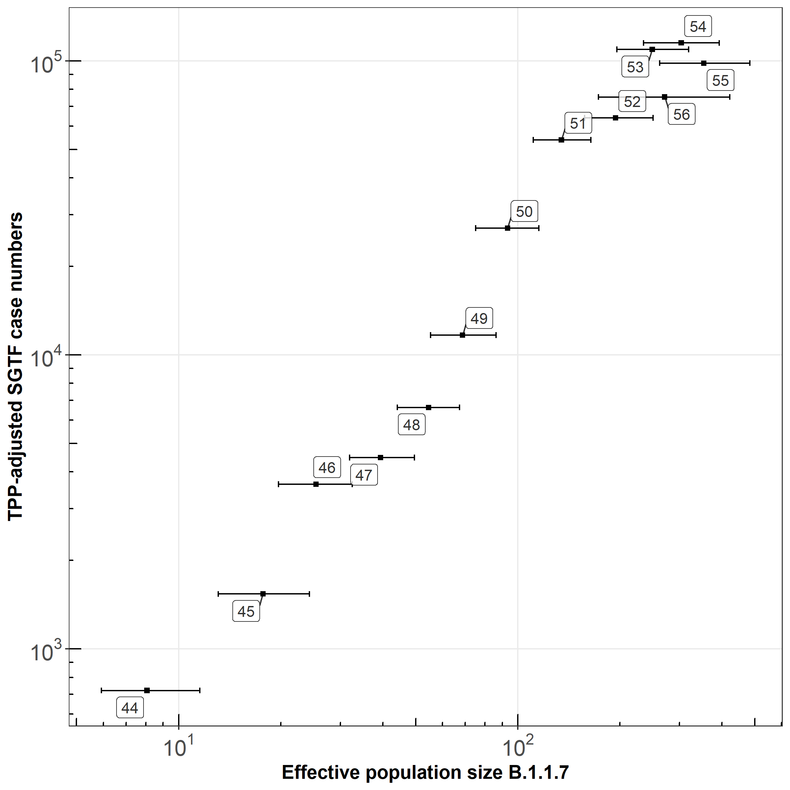

# Estimating effective population size (Ne) through time of lineage B.1.1.7 using mlesky

Steps to perform [phylodynamic inference](https://www.biorxiv.org/content/10.1101/2021.01.18.427056v1) of effective population size for time-scaled phylogenies. 

These scripts require installation of the `mlesky` package, which can be [downloaded here](https://github.com/emvolz-phylodynamics/mlesky). To download the package directly in R, you can run the following:


```r
devtools::install_github('emvolz-phylodynamics/mlesky') 
```

We will also need the `treedater` package [as described here](https://academic.oup.com/ve/article/3/2/vex025/4100592). To install run the following:

```r
install.packages("treedater")
```


Other packages required:


```r
library( ape )
library( lubridate )
library( glue )
library( sarscov2 ) 
library( ggplot2 )
library( grid )
library( gridExtra )
library( ggtree )
library( alakazam )
library( stringi )
require( hrbrthemes )
require( scales )
require( ggrepel )
```


## Lineage B.1.1.7

To perform this analysis, you will need 
1) a list of maximum-likelihood trees in the `.nwk` format built from sequences from the B.1.1.7 lineage (and any other lineage you wish to analyse)
2) a `.csv` metadata file with a column of sequence names (that match `tip.label` of the trees in your `.nwk` file) and their sample dates


Loading tree:
```r
mltr <- ape::read.tree("sampler1_B.1.1.7_2021-02-13_n=3000.nwk")
mltr

```


```
## 100 phylogenetic trees
```

Loading metadata:
```r
metadata = read.csv( "metadata.csv" , stringsAs = FALSE , header=TRUE )
metadata$sample_date <- as.Date( metadata$sample_date )
metadata$sample_time <- decimal_date( metadata$sample_date ) # converting to decimal date for use in treedater
```

## Dating the trees


To date the trees we have to assume a clock rate. To incorporate uncertainty around this parameter in our results we sample this from a distribution. Here we define this as a normal distribution with mean and standard deviation that we have estimated from previous model-based phylodynamic analyses.

Mean clock rate and 95% HPD interval: 5.9158 x 10<sup>-4</sup>	(5.2065 x 10<sup>-4</sup> - 6.7144 x 10<sup>-4</sup>)
```r
mr = 5.9158E-4
mrci = 	c( 5.2065E-4, 6.7144E-4)
mrsd = diff( mrci ) / 4 / 1.96

```

We are using `treedater` to date every maximum-likelihood tree 10 times; each time will assume a clock rate drawn from the above distribution. The code to perform this is below:


```r
# make treedater trees for each lineage
tds_list_B.1.1.7 = date_trees(
  mltr_fn = "sampler1_B.1.1.7_2021-02-13_n=3000.nwk",
  ofn = paste0('Sample_England_sampler1_B.1.1.7_2021-02-13_n=3000_n_tree_dating_10'), 
  metadata = metadata, 
  meanrate = mr,
  n_tree_dating = 10,
  meanratesd = mrsd, 
  ncpu = 4)

```
This will save your dated trees as an `.RDS` file. The full code (and functions) to do this are provided in `d1_date_trees.R`. Also given is the code to perform the same methods on trees built from lineage B.1.177, and also control sequences from across England matched by time and place to the B.1.1.7 alignments.


## Performing mlesky on the dated trees


From `d1_date_trees.R`, we have produced a list of dated trees. Next we define a time period over which we would like to estimate Ne(t), and run `mlesky`:


```r
# time period over which to estimate Ne
taxis = decimal_date( seq( as.Date( '2020-10-15') , as.Date('2021-01-24'), by = 1) )

# run mlesky
res_mlesky_B.1.1.7 = run_mlesky(
  tds_list = "Sample_England_sampler1_B.1.1.7_2021-02-13_n=3000_n_tree_dating_10_dated_trees.rds",
  ofn = "Sample_England_sampler1_B.1.1.7_2021-02-13_n=3000_n_tree_dating_10", 
  taxis = taxis)
```
This will save your mlesky outputs as an `.RDS` file. The functions are provided in `d2_mlesky.R`, as well as the code to perform the same analysis for other lineages.


## Comparing Ne(t) with TPP-adjusted SGTF


From `d2_mlesky.R` we have produced estimates of Ne(t) across various dated trees for B.1.1.7, using `mlesky`. Now we can plot our estimates of Ne(t) at each epiweek against the TPP-adjusted SGTF case numbers.

Read in mlesky output and calculate the median and 95% HPD across trees for Ne(t):

```r
tN = readRDS( "Sample_England_sampler1_B.1.1.7_2021-02-13_n=3000_n_tree_dating_10_mlesky.rds" )
q_ne = as.data.frame(t(apply( tN$ne, 1, function(x) quantile( na.omit(x), c(.5, .025, .975 )) )))
```

Convert decimal date to epiweek so we can compare to TPP-adjusted SGTF. The first few weeks of 2021 are interpreted as weeks 54-56 of 2020:

```r
# Converts decimal date to epiweek
q_ne$epiweek = lubridate::epiweek(lubridate::date_decimal(tN$time))
q_ne$epiweek = ifelse(q_ne$epiweek < 4, q_ne$epiweek+53, q_ne$epiweek)
```


Read SGTF data:
```r
sgss_stp_new_43_56_weeks <- readRDS("data/sgss_stp_new_43_56_weeks.rds")
sgss_stp_new_43_56_weeks
```

```
# A tibble: 588 x 15
# Groups:   area, epiweek [588]
   area  epiweek epistop    sgss_s_positive sgss_s_negative total_cases sgss_s_positive~ sgss_s_negative~ total_cases_adj1 regcd  probs
   <chr>   <dbl> <date>               <int>           <int>       <int>            <int>            <int>            <int> <chr>  <dbl>
 1 Bath~      43 2020-10-24             241              13        1101              216               13             1101 E540~ 0.0475
 2 Bath~      44 2020-10-31             323              10        1373              290               10             1373 E540~ 0.126 
 3 Bath~      45 2020-11-07             326              10        1422              269               10             1422 E540~ 0.280 
 4 Bath~      46 2020-11-14             771              30        1611              717               30             1611 E540~ 0.487 
 5 Bath~      47 2020-11-21             505              24        1145              448               24             1145 E540~ 0.679 
 6 Bath~      48 2020-11-28             362              22         760              325               22              760 E540~ 0.816 
 7 Bath~      49 2020-12-05             327              40         755              282               40              755 E540~ 0.902 
 8 Bath~      50 2020-12-12             330             103         808              290              103              808 E540~ 0.951 
 9 Bath~      51 2020-12-19             356             245        1291              317              245             1291 E540~ 0.977 
10 Bath~      52 2020-12-26             422             446        1936              360              446             1936 E540~ 0.990 
# ... with 578 more rows, and 4 more variables: sgss_s_negative_corrected <dbl>, sgss_s_positive_corrected <dbl>,
#   sgss_s_negative_corrected_adj1 <dbl>, sgss_s_positive_corrected_adj1 <dbl>
```

The following produces a dataframe which combines TPP-adjusted SGTF and the estimate of Ne at each epiweek. If there are multiple timepoints in each epiweek in the `mlesky` analysis, the last timepoint will be chosen to represent Ne at the *end* of the week.

```r
# Creates data frame 
pldf <- as.data.frame(do.call(rbind, lapply(unique(sgss_stp_new_43_56_weeks$epiweek), function(week) {
  if(nrow(sgss_stp_new_43_56_weeks[sgss_stp_new_43_56_weeks$epiweek == week, ]) == 42) {# checking there are no duplicates; there are 42 STPs
    total_S_neg = sum(sgss_stp_new_43_56_weeks[sgss_stp_new_43_56_weeks$epiweek == week, "sgss_s_negative_corrected"])
    ne = tail( q_ne[which(q_ne$epiweek == week), ][,"50%"], 1)
    neub = tail( q_ne[which(q_ne$epiweek == week), ][,"97.5%"], 1)
    nelb = tail( q_ne[which(q_ne$epiweek == week), ][,"2.5%"], 1)
    return(c(week = week, total_S_neg = total_S_neg, ne = ne, neub = neub, nelb = nelb))
  }
})))

# Remove any rows with NAs
pldf = pldf[!is.na(pldf$ne),] 
```

Plotting the relationship:

```r
pl = ggplot(pldf, aes(x = ne, y = total_S_neg)) + geom_point( shape = 15) + 
  geom_errorbarh(aes(xmin = nelb, xmax = neub, y = total_S_neg)) +
  scale_y_continuous( trans = "log10", breaks = function(x) {
      brks <- extended_breaks(Q = c(1, 5))(log10(x))
      10^(brks[brks %% 1 == 0])
    }, labels = math_format(format = log10) ) +
  scale_x_continuous(  trans = "log10", breaks = function(x) {
      brks <- extended_breaks(Q = c(1, 5))(log10(x))
      10^(brks[brks %% 1 == 0]) },  labels = math_format(format = log10)  )+
  theme_bw() + labs(x = "Effective population size B.1.1.7", y = "TPP-adjusted SGTF case numbers") +
  theme(axis.text=element_text(size=16),
        axis.title=element_text(size=14,face="bold"), panel.grid.minor = element_blank())+ annotation_logticks() +
  geom_label_repel(aes(x = ne, y = total_S_neg, label = week), alpha = 0.8)
pl

ggsave( plot = pl, file = "TPP-adjusted_SGTF_vs_Ne_mlesky_to_week_56.pdf", width = 8, height = 8 )
ggsave( plot = pl, file = "TPP-adjusted_SGTF_vs_Ne_mlesky_to_week_56.png", width = 8, height = 8 )

```

Plot of TPP-adjusted SGTF against estimated effective population size using `mlesky`. Each point represents an epiweek of 2020:



# Estimating growth rate difference and frequency of VOC from genome count data 

`d4.R` and `d4.stan` contain code to reproduce Bayesian regression analysis described in Methods Section 2. 

`d5.R` contains code to combine phylodynamic Ne(t) estimates (d1-3) and estimated frequencies (d5) to estimate R(t) in VOC and non-VOC. This is described in Methods Section 4.


